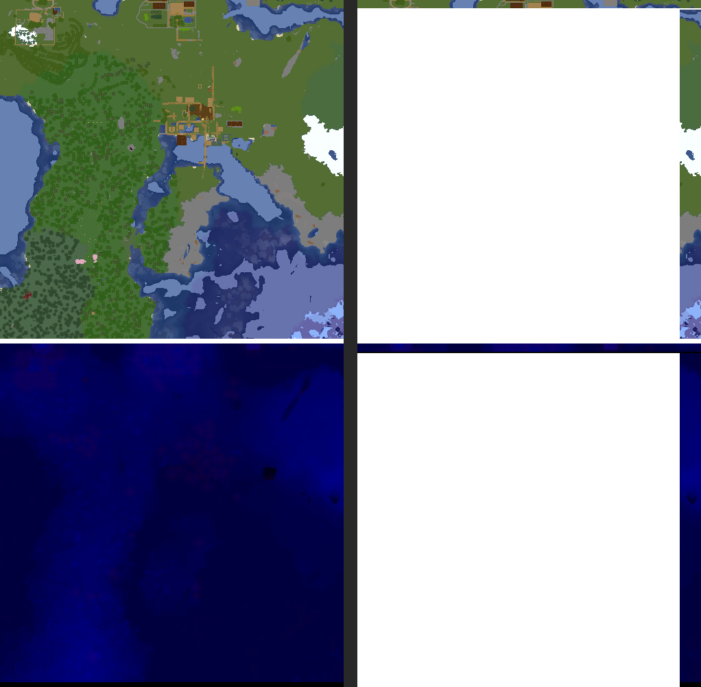

# Spike: can two concurrent BlueMap renders share a map storage without corrupting lowres?

**Date:** 2026-08-09
**Branch:** `feat/phase-4-sharding`
**Scope:** Phase 4 pre-condition per `docs/superpowers/specs/2026-08-08-apus-design.md` §14
(Phase 4 — Region-Sharding) and §15.5.

**Result: NEGATIVE.** Two concurrent BlueMap CLI processes rendering disjoint, adjacent
region sets into the same map storage reproducibly corrupt the lowres (zoomed-out) tile
pyramid. The corruption is not cosmetic: one lowres tile went from ~99% opaque rendered
terrain in the reference render to ~91% blank/transparent pixels in every one of three
concurrent repeats. A sequential (non-racing) control run corrupted *more* tiles, not
fewer, which rules out "just bad luck" as the explanation. See "Bewertung" below for how
far this result generalizes and what it doesn't cover.

---

## 1. Question

Can two BlueMap processes render disjoint region sets of the same map concurrently into
the same map storage, without damaging the zoomed-out (lowres) views?

Granular per-tile, per-chunk storage means disjoint regions never touch the same *hires*
tile or chunk file, so hires rendering was never the concern. Lowres tiles are different:
each one is built by **aggregating** color, height and light across a fixed-size block of
higher-resolution tiles (`lodFactor = 5` by default — confirmed by asking
`BlueMap-Minecraft/BlueMap` directly: `LowresLayer` computes
`nextLodTileX = floorDiv(tilePos.x, lodFactor)`, then averages a `lodFactor × lodFactor`
block of the finer level into one output pixel). Because `lodFactor` (5 hires tiles = 160
blocks) does not evenly divide a region's edge (512 blocks), a lowres tile's aggregation
group generally straddles a region boundary — and hence, under sharding, a shard
boundary. Two shards that both touch hires tiles feeding the *same* lowres tile can race
on writing it back to shared storage. Granular storage prevents one shard from corrupting
another's chunk data; it says nothing about whether the shared, aggregated lowres file
converges to the right answer.

An earlier informal assessment called this "unlikely." That claim conflated "storage is
granular" with "no shared writes happen," which are different properties — this spike
tests the second one directly instead of arguing about it.

## 2. Setup

### 2.1 Fixture

`testdata/mini-world` originally held two region files, `r.0.0.mca` and `r.0.1.mca` —
adjacent along Z, sharing one 512-block edge. That edge is real, but short: it only
spans one region's width (16 hires tiles ≈ 3–4 lowres-L1 tiles), giving few chances for a
shared lowres tile to actually get touched by both sides during a render that only takes
about a minute.

The fixture was extended with two more region files pulled from
`/mnt/projects/oss/onelitefeather/falco-demo-world-backup-1.21.10/region/`: `r.-1.0.mca`
(10,223,616 bytes) and `r.-1.1.mca` (8,617,984 bytes) — region-only, no
`playerdata/`/`stats/`/`advancements/`. This turns the fixture into a contiguous 2×2
block of regions:

```
            region x=-1        region x=0
region z=0   r.-1.0.mca          r.0.0.mca
region z=1   r.-1.1.mca          r.0.1.mca
```

world block bounds: x ∈ [-512, 511], z ∈ [0, 1023]. Addition: 17.97 MB (under the ~20 MB
budget); total fixture: 36.27 MB. `level.dat` is unchanged (byte-identical to the backup's
copy). Details in `testdata/README.md`.

**A split that looked obvious turned out to be the wrong one.** The natural first idea —
split the world at `x = 0` into the `x=-1` and `x=0` region columns — sits exactly on the
world origin, which is *always* a multiple of `lodFactor` regardless of its value. Every
lowres level's tile-group boundary also falls on a multiple of `lodFactor`, so an `x = 0`
split never puts two shards' hires tiles into the same lowres group — it can't reproduce
the race by construction. The fixture had to be extended in the orthogonal direction
instead: splitting at the **z = 512 region boundary** (between region row z=0 and z=1)
does *not* coincide with a `lodFactor`-multiple boundary, so hires tiles from both rows
legitimately feed the same lowres tiles. This is why two regions weren't enough and why
simply having *more* regions wasn't the point — the boundary's position relative to the
lowres grid is what matters. This is recorded so a future reader doesn't repeat the same
false start.

### 2.2 Splitting the world: render-mask, not the future production API

Per §14 of the design spec, if this spike came back positive, the real Phase 4
implementation would use a custom runner calling BlueMap's public
`scheduleMapUpdateTask(map, regions)` — not `render-mask`. That API doesn't exist yet.
For this spike, `render-mask` (a `box` mask per shard, full Y range, restricted X/Z) was
used instead, exactly as the task brief suggested, via a custom entrypoint
(`spike-entrypoint.sh`) that appends the mask block to the generated `map.conf` after
`runner/bin/render-config.sh` runs — the production `render-config.sh` was **not**
modified.

Verified before using it (by decompiling `cli.jar`'s `MapConfig`/`MaskConfig` classes and
independently confirming with `deepwiki` against the BlueMap source):
`render-mask` does **not** skip reading region files outside the mask — it masks at the
block-query level during rendering (`isInsideRenderBounds()`), returning `AIR` for
out-of-mask blocks when `render-edges: true` (the runner's unconditional default). Since
the mask boundary is placed on a region boundary (a multiple of 32 blocks, the hires tile
size), every hires tile a shard produces is either fully inside or fully outside its own
mask — no hires tile straddles the mask edge, so `--fix-edges` was not needed for this
spike (task correctly anticipated the question; the answer is it doesn't apply here
because of how the boundary was chosen). This kept the experiment focused on the lowres
question rather than on hires seam artifacts, which the task explicitly said were out of
scope.

### 2.3 Infrastructure

- `apus/runner:dev`, already built (see `runner/README.md`), unchanged.
- A private `apus-spike-net` Docker bridge network and one `minio/minio` container on it
  — **no published ports** (only reachable by name from other containers on that
  network).
- MinIO buckets: `bundles` (world source), `maps-reference`, `maps-parallel-1..3`,
  `maps-sequential`.
- All comparison/inspection done via throwaway `minio/mc` containers on the same network
  plus local Python (Pillow) for pixel-level diffing — no host-side S3 tooling installed,
  no host ports opened.
- Nothing under `isukuverlagcms-*` was touched; the spike network, MinIO container, and
  all buckets were torn down after the run (see §6).

Scripts, all committed alongside this report in
`docs/superpowers/spikes/2026-08-09-lowres-sharding-spike/`:

| File | Purpose |
|---|---|
| `spike-entrypoint.sh` | Runner entrypoint variant that adds `render-mask` to `map.conf` |
| `run-spike.sh` | Orchestrates network, MinIO, seeding, reference render, N parallel repeats, sequential control |
| `compare_tiles.py` | Mirrors a bucket's lowres tiles locally and diffs them (MD5 + per-pixel) against the reference |

## 3. Execution

1. **Reference render:** one `apus/runner:dev` container, no mask, whole 4-region world,
   into `maps-reference`. Exit 0, ~65 s (01:12:05–01:13:03 UTC).
2. **Parallel render, repeated 3×:** each repeat used a fresh, empty bucket
   (`maps-parallel-1`, `-2`, `-3`). Two containers per repeat:
   - **south**: `render-mask` x∈[-512,511], z∈[0,511] → regions `r.-1.0.mca` + `r.0.0.mca`
   - **north**: `render-mask` x∈[-512,511], z∈[512,1023] → regions `r.-1.1.mca` + `r.0.1.mca`

   Both started via `docker run -d` back to back (no artificial stagger) and awaited with
   `docker wait`. Logs confirm real overlap, not just nominal concurrency — in repeat 1
   both containers logged `Start updating 1 maps ...` at 01:15:58 and both finished
   within 2 seconds of each other (01:16:39 / 01:16:41). All 6 container runs across the
   3 repeats exited 0.
3. **Sequential control (not requested by the task, added for rigor):** the same two
   shards into `maps-sequential`, but **south runs to completion, exits, is removed —
   only then does north start.** No race window at all. This distinguishes "the result
   depends on write order" (a race) from "any masked two-shard render into shared storage
   produces this specific error regardless of order" (not a race, a deterministic bug in
   the masking approach itself). Both exited 0.
4. **Comparison:** `compare_tiles.py` mirrors `tiles/1`, `tiles/2`, `tiles/3` (the lowres
   levels — established empirically from the reference bucket's own object listing:
   `tiles/0` is hires `.prbm.gz` geometry, `tiles/1..3` are `.png` lowres images, `lodCount
   = 3` matching BlueMap's documented default) out of each bucket and diffs every file
   against the reference by MD5, then by per-pixel RGBA comparison for anything that
   differs.

## 4. Measurements

### 4.1 Structural completeness (granular storage doing its job)

Every bucket — reference and all 4 shard runs — has **exactly 997 objects with an
identical key set** (961 hires tiles + 24 lowres tiles + settings/textures/live/rstate
metadata). No missing tiles, no extra tiles, in any run. This confirms the premise the
task already granted: per-tile, per-chunk storage does not go structurally missing or
duplicate under concurrent disjoint writes. The lowres layer is where the differences
are.

### 4.2 Content: concurrent parallel runs (3 repeats)

**7 of 24 lowres tiles (29%) differ from the reference in every one of the 3 concurrent
repeats — the same 7 files each time, and byte-for-byte (MD5) identical across all 3
repeats:**

| Tile | Differing pixels | % of tile |
|---|---:|---:|
| `tiles/1/x-1/z1.png` | 456,494 / 502,002 | **90.93%** |
| `tiles/2/x-1/z0.png` | 28,254 / 502,002 | 5.63% |
| `tiles/1/x0/z1.png` | 1,928 / 502,002 | 0.38% |
| `tiles/3/x-1/z0.png` | 766 / 502,002 | 0.15% |
| `tiles/2/x0/z0.png` | 194 / 502,002 | 0.04% |
| `tiles/1/x-2/z1.png` | 44 / 502,002 | 0.01% |
| `tiles/3/x0/z0.png` | 40 / 502,002 | 0.01% |

The worst case, `tiles/1/x-1/z1.png`, is not a subtle rounding difference. The reference
tile is 99.3% opaque (498,495 of 502,002 pixels have alpha > 0) and shows fully rendered
terrain — forest, rivers, a village, a desert. The corrupted tile from every concurrent
run is only 8.6% opaque (43,003 pixels): almost the entire tile is blank/transparent,
with just a thin sliver of real content along one edge.




This is a **lost update**: the lowres tile is a read-modify-write against shared storage.
One shard read the tile (empty, since the bucket started fresh), wrote its own
contribution; the other shard's read happened before that write landed, so it wrote back
a tile missing almost all of the first shard's content, and that write landed last.

### 4.3 Content: sequential control (no race window)

**10 of 24 lowres tiles (42%) differ — more than the concurrent case, not fewer,** and
the set of affected files is different: it includes 3 tiles
(`tiles/1/x0/z0.png`, `x-1/z0.png`, `x-2/z0.png`) that matched the reference exactly in
all 3 concurrent runs, but differ here. Conversely, the tiles that differ in both cases
differ by *less* under the sequential ordering (e.g. `tiles/1/x-1/z1.png`: 2.40% here vs.
90.93% concurrently).

This is the key control result: **the final state is a function of write order.** That
is the defining signature of a race condition, not a fixed, order-independent artifact of
using `render-mask`. It also shows the failure mode is not exclusively a narrow
"both processes touch the exact same file at the exact same millisecond" race — even a
fully serialized south-then-north run corrupts the shared lowres layer, because each
process (as configured here, via `render-mask`) recomputes lowres tiles it touches from
its own masked, partial view of the world rather than by correctly reading and merging
whatever the other shard already wrote. Serializing the *order* of two masked runs is not
sufficient to fix this on its own.

### 4.4 Reproducibility

| Run | Lowres tiles differing | Deterministic across repeats? |
|---|---:|---|
| Concurrent × 3 | 7/24 (29%) each time | Yes — MD5-identical corrupted bytes in all 3 repeats |
| Sequential × 1 | 10/24 (42%) | N/A (single ordering by construction) |

## 5. How belastbar (robust) is this result?

**Strong for the core question, with named gaps.**

What the evidence directly supports: under the tested setup, concurrent renders **do**
corrupt shared lowres tiles, visibly and severely, and this is not a fluke — it
reproduced identically 3/3 times, and a structurally different control (sequential
ordering) independently confirms the failure is order-dependent rather than a one-off
artifact. The mechanism matches the design doc's theoretical concern exactly:
`LowresLayer` aggregates across a `lodFactor`-sized group of hires tiles that generally
straddles a region boundary, confirmed both by decompiling `MapConfig`/`LowresLayer`-
adjacent classes and independently via `deepwiki` against the BlueMap source. This is not
"we didn't happen to win the race" — the setup was specifically engineered (via the z=512
split, chosen *because* it avoids the accidental grid-alignment of the naive x=0 split)
to make the shared-tile condition likely, and it triggered on the first attempt and every
attempt after.

What it does **not** cover, honestly:

1. **Small world.** 4 regions, 24 lowres tiles total, ~65 s renders. A production world
   has orders of magnitude more region boundaries and shared lowres tiles, and a render
   that takes much longer gives more, not fewer, opportunities for shards to overlap in
   time. This is a reason to expect the problem is at least as bad at scale, not a reason
   to discount the finding — but it wasn't tested directly.
2. **`render-mask`, not `scheduleMapUpdateTask`.** The task brief endorsed `render-mask`
   as the practical tool for this spike, and the identified failure lives in
   `LowresLayer`'s tile aggregation/storage code, which any region-restricted render path
   — mask-based or API-based — would still route through. But this spike did not build
   the custom-runner-plus-`scheduleMapUpdateTask` path and therefore cannot rule out that
   a well-designed use of that API (e.g. with explicit coordination or a different update
   trigger) behaves differently. That remains an assumption, not a tested fact.
3. **One boundary orientation, one topology.** Only a 2-way, single straight-line z-split
   was tested. Other shard counts, boundary orientations, or non-contiguous shard shapes
   were not tried. The generalization from "this boundary races" to "every boundary
   configuration races the same way" is inference from the confirmed mechanism, not
   direct measurement.
4. **Deterministic within one harness, not a broad interleaving sweep.** The 3 concurrent
   repeats produced byte-identical corruption, which is good evidence the result isn't
   spurious, but it also means these 3 repeats sampled one write-ordering outcome, not a
   range of them. The sequential control supplies a second, deliberately different
   ordering and gets a different (also bad) result, which is the strongest evidence here
   that this is genuinely order-sensitive — but a wider sweep (e.g. artificial delays,
   more repeats, varied thread counts) was not attempted.
5. **Hires tiles were not compared for content**, only for key-set completeness, per the
   task's own framing that hires (protected by granular per-tile/per-chunk storage) was
   never the concern.

Net assessment: this is not a "we didn't happen to hit the race, so we can't say
anything" result — the race was hit reliably and reproduced with clean visual evidence,
and a second, structurally different experiment (the sequential control) corroborates
that the outcome depends on execution order rather than being an unrelated artifact. The
gaps above bound the claim to "the described lowres-aggregation hazard is real and
severe under a realistic sharding approach at small scale" rather than "proven safe or
unsafe at every scale and for every possible implementation."

## 6. Recommendation

**Do not build Phase 4 region-sharding as independent, uncoordinated processes writing
disjoint region sets directly into the same map storage.** The lowres-tile race is real,
reproducible, and produces visibly broken zoomed-out map views (a majority-blank tile
where terrain should be) — exactly the failure the design spec flagged as the reason to
gate Phase 4 behind this spike.

Per §14 of the design spec, the two named alternatives are:

- **Two-stage rendering:** shards render hires tiles only (safe — granular storage, no
  shared aggregation involved); a single, non-concurrent final pass rebuilds the entire
  lowres pyramid from the now-complete hires data. This avoids the race entirely because
  only one process ever writes a lowres tile. Worth prototyping next, since this spike's
  sequential control shows that ordering alone isn't sufficient with masked, independent
  processes — the final pass would need to be a real full-map lowres rebuild (e.g.
  `--force-render` scoped to lowres, or the equivalent via `scheduleMapUpdateTask`), not
  just "run shard B after shard A."
- **Vertical scaling instead of horizontal sharding:** more render threads in one
  process (`APUS_RENDER_THREADS`), which sidesteps the shared-lowres-storage problem
  altogether since there is only ever one writer.

If sharding is still desired later, treat "does `scheduleMapUpdateTask` avoid this" as
its own open question requiring its own verification — this spike's finding transfers by
inference (same `LowresLayer` code underneath) but was not directly tested against that
API.

## 7. Cleanup

All spike containers (`apus-spike-minio`, `apus-spike-reference`,
`apus-spike-south-{1,2,3}`, `apus-spike-north-{1,2,3}`, `apus-spike-south-seq`,
`apus-spike-north-seq`), the `apus-spike-net` network, and all `maps-*`/`bundles` MinIO
buckets created for this spike were removed after the measurements above were captured.
`isukuverlagcms-*` containers were not touched. No host ports were published at any
point.
